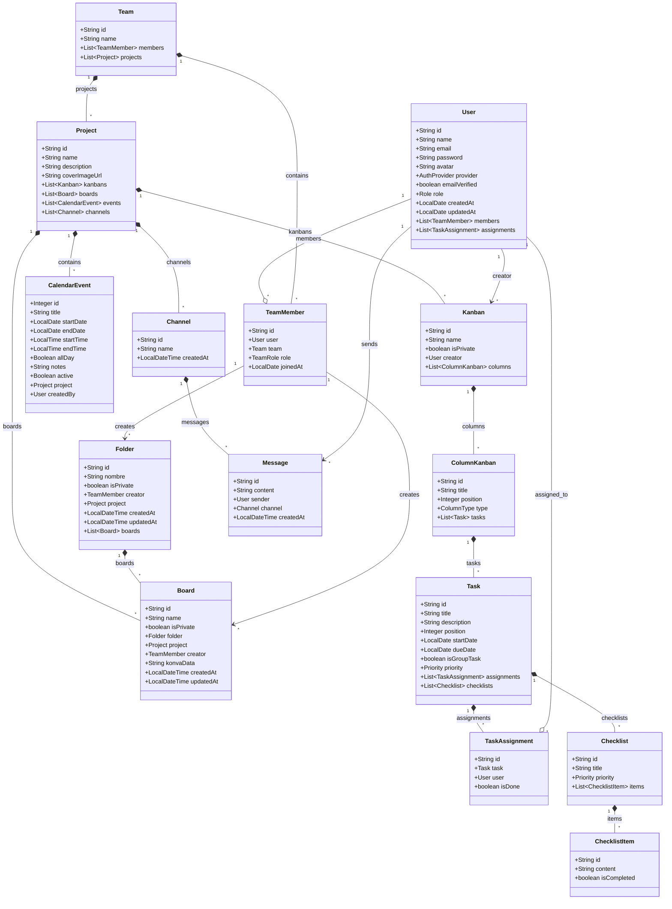

# Mi Modelo de Clases

```mermaid
classDiagram
    direction TB

    class User {
        +String id
        +String name
        +String email
        +String password
        +String avatar
        +AuthProvider provider
        +boolean emailVerified
        +Role role
        +LocalDate createdAt
        +LocalDate updatedAt
        +List~TeamMember~ members
        +List~TaskAssignment~ assignments
    }

    class Team {
        +String id
        +String name
        +List~TeamMember~ members
        +List~Project~ projects
    }

    class TeamMember {
        +String id
        +User user
        +Team team
        +TeamRole role
        +LocalDate joinedAt
    }

    class Project {
        +String id
        +String name
        +String description
        +String coverImageUrl
        +List~Kanban~ kanbans
        +List~Board~ boards
        +List~CalendarEvent~ events
        +List~Channel~ channels
    }

    class Folder {
        +String id
        +String nombre
        +boolean isPrivate
        +TeamMember creator
        +Project project
        +LocalDateTime createdAt
        +LocalDateTime updatedAt
        +List~Board~ boards
    }

    class Board {
        +String id
        +String name
        +boolean isPrivate
        +Folder folder
        +Project project
        +TeamMember creator
        +String konvaData
        +LocalDateTime createdAt
        +LocalDateTime updatedAt
    }

    class CalendarEvent {
        +Integer id
        +String title
        +LocalDate startDate
        +LocalDate endDate
        +LocalTime startTime
        +LocalTime endTime
        +Boolean allDay
        +String notes
        +Boolean active
        +Project project
        +User createdBy
    }

    class Kanban {
        +String id
        +String name
        +boolean isPrivate
        +User creator
        +List~ColumnKanban~ columns
    }

    class ColumnKanban {
        +String id
        +String title
        +Integer position
        +ColumnType type
        +List~Task~ tasks
    }

    class Task {
        +String id
        +String title
        +String description
        +Integer position
        +LocalDate startDate
        +LocalDate dueDate
        +boolean isGroupTask
        +Priority priority
        +List~TaskAssignment~ assignments
        +List~Checklist~ checklists
    }

    class TaskAssignment {
        +String id
        +Task task
        +User user
        +boolean isDone
    }

    class Channel {
        +String id
        +String name
        +LocalDateTime createdAt
    }

    class Message {
        +String id
        +String content
        +User sender
        +Channel channel
        +LocalDateTime createdAt
    }

    class Checklist {
        +String id
        +String title
        +Priority priority
        +List~ChecklistItem~ items
    }

    class ChecklistItem {
        +String id
        +String content
        +boolean isCompleted
    }

    %% Relaciones Principales
    User "1" --o "*" TeamMember : members
    Team "1" *-- "*" TeamMember : contains
    Team "1" *-- "*" Project : projects

    %% Relaciones de Proyecto
    Project "1" *-- "*" Kanban : kanbans
    Project "1" *-- "*" Board : boards
    Project "1" *-- "*" Channel : channels
    Project "1" *-- "*" CalendarEvent : contains

    %% Relaciones de Organización (Folder/Board)
    Folder "1" *-- "*" Board : boards
    TeamMember "1" --> "*" Folder : creates
    TeamMember "1" --> "*" Board : creates

    %% Relaciones de Tareas y Kanban
    Kanban "1" *-- "*" ColumnKanban : columns
    ColumnKanban "1" *-- "*" Task : tasks
    User "1" --> "*" Kanban : creator

    %% Relaciones de Tareas y Usuarios
    Task "1" *-- "*" TaskAssignment : assignments
    User "1" --o "*" TaskAssignment : assigned_to
    Task "1" *-- "*" Checklist : checklists
    Checklist "1" *-- "*" ChecklistItem : items

    %% Relaciones de Chat
    Channel "1" *-- "*" Message : messages
    User "1" --> "*" Message : sends
```
