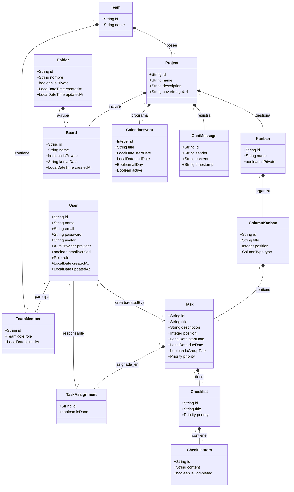

# Mi Modelo de Clases

```mermaid
classDiagram
    direction TB

    class User {
        +String id
        +String name
        +String email
        +String password
        +String avatar
        +AuthProvider provider
        +boolean emailVerified
        +Role role
        +LocalDate createdAt
        +LocalDate updatedAt
    }

    class Team {
        +String id
        +String name
    }

    class TeamMember {
        +String id
        +TeamRole role
        +LocalDate joinedAt
    }

    class Project {
        +String id
        +String name
        +String description
        +String coverImageUrl
    }

    class Kanban {
        +String id
        +String name
        +boolean isPrivate
    }

    class ColumnKanban {
        +String id
        +String title
        +Integer position
        +ColumnType type
    }

    class Task {
        +String id
        +String title
        +String description
        +Integer position
        +LocalDate startDate
        +LocalDate dueDate
        +boolean isGroupTask
        +Priority priority
    }

    class TaskAssignment {
        +String id
        +boolean isDone
    }

    class Checklist {
        +String id
        +String title
        +Priority priority
    }

    class ChecklistItem {
        +String id
        +String content
        +boolean isCompleted
    }

    class Folder {
        +String id
        +String nombre
        +boolean isPrivate
        +LocalDateTime createdAt
        +LocalDateTime updatedAt
    }

    class Board {
        +String id
        +String name
        +boolean isPrivate
        +String konvaData
        +LocalDateTime createdAt
    }

    class CalendarEvent {
        +Integer id
        +String title
        +LocalDate startDate
        +LocalDate endDate
        +Boolean allDay
        +Boolean active
    }

    class ChatMessage {
        +String id
        +String sender
        +String content
        +String timestamp
    }

    %% Relaciones de Usuario y Equipos
    User "1" --o "*" TeamMember : participa
    Team "1" *-- "*" TeamMember : contiene
    Team "1" *-- "*" Project : posee

    %% Relaciones de Proyecto
    Project "1" *-- "*" Kanban : gestiona
    Project "1" *-- "*" Board : incluye
    Project "1" *-- "*" CalendarEvent : programa
    Project "1" *-- "*" ChatMessage : registra

    %% Relaciones de Kanban y Tareas
    Kanban "1" *-- "*" ColumnKanban : organiza
    ColumnKanban "1" *-- "*" Task : contiene

    %% Relaciones de Tareas y Asignaciones
    Task "1" *-- "*" TaskAssignment : asignada_en
    User "1" --o "*" TaskAssignment : responsable
    Task "1" *-- "*" Checklist : tiene
    Checklist "1" *-- "*" ChecklistItem : contiene
    User "1" --> "*" Task : crea (createdBy)

    %% Relaciones de Folder y Board
    Folder "1" *-- "*" Board : agrupa

```
